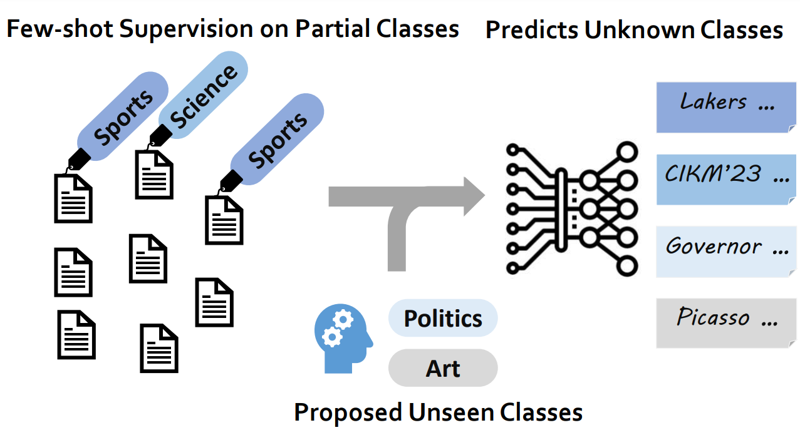
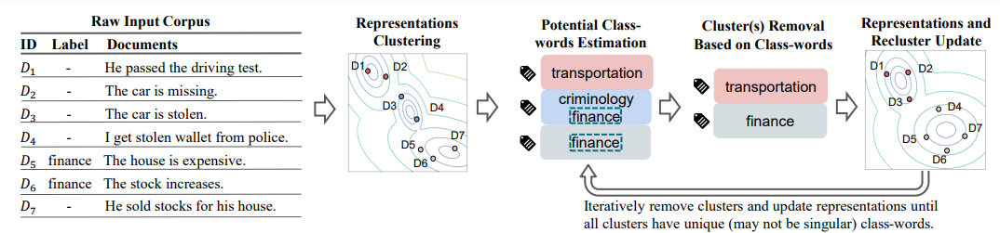

# WOT-Class: Weakly Supervised Open-world Text Classification

This repo contains the data and the code for the [paper](https://arxiv.org/pdf/2305.12401.pdf).

## Overview

**Open-world Classification**

Weakly supervised text classification methods reduced the required human supervision. However, all these methods require that the human-provided known classes cover all the classes of interest, which can be very difficult, especially in the dynamic and ever-changing real world. In this work, we work on a novel yet important problem of weakly supervised open-world text classification, where supervision is only needed for a few examples from a few known classes and the machine should handle both known and unknown classes in test time.



**WOT-Class**

We propose a novel framework WOT-Class which follows an iterative process of (a) clustering text to new classes, (b) mining and ranking indicative words for each class, and (c) merging redundant classes by using the overlapped indicative words as a bridge. Our extensive experiments on 7 popular text classification datasets have shown the strong performance of WOT-Class.  WOT-Class gains a 23.33% greater average absolute macro-F1 over the current best method across all datasets.



## Requirements
The python version we used is 3.7, also, you need to install torch. The other requirements are listed in `requirements.txt`.

## Data & Methods
The datasets can be accessed at `data/`.

The methods are implemented in `src/`.

To run our code on a dataset (e.g., AGNews), please first follow the guide of [CGExpan](https://github.com/yzhan238/CGExpan) or [HiExpan](https://github.com/mickeysjm/HiExpan) to process the raw data and get the `entity2id.txt` and `sentences.json` files under the training dataset file (already provided for our datasets).

Then, you can train and test our method by calling `src/run.sh`.

```
cd src
sh run.sh {dataset_name} {gpu_id}
```

You can also modify `run.sh` to control the hyperparameters we support.
The performances on the datasets, and their behaviors when using different hyperparameters, can be found in our paper.

## Citation
If you find this repo useful, please cite our paper:
```
@article{Wang2023WOTClassWS,
  title={WOT-Class: Weakly Supervised Open-world Text Classification},
  author={Tianle Wang and Zihan Wang and Weitang Liu and Jingbo Shang},
  journal={ArXiv},
  year={2023},
  volume={abs/2305.12401}
}
```